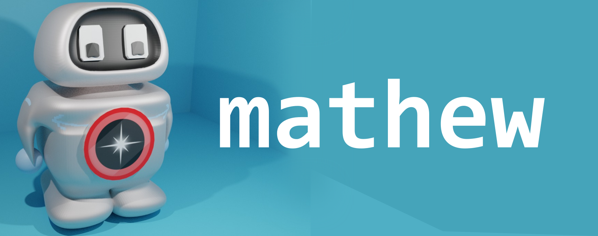

# Helloooo , I'm 

`"And I absolutely ❤ to code"`
 
&nbsp;

 
 ## My Interests include:
 - AI 
 - Robotics 
 - Game Dev 
 - App Dev 
 - And in general Science and Technology 

 Hence the name STAR[***S**cience **T**echnology **A**nd **R**obotics*] 

## Skills:
- Languages
  - Python
  - C#
  - C++
  - Little bit of some other languages
- Unity Game Engine
- Arduino
- Raspberry Pi
- Machine Learning, Deep Learning
- 3D Designing[Blender]
- 2D Designing
- Android Development(Flutter)

## Links

<!---
Star-Code6/Star-Code6 is a ✨ special ✨ repository because its `README.md` (this file) appears on your GitHub profile.
You can click the Preview link to take a look at your changes.
--->
